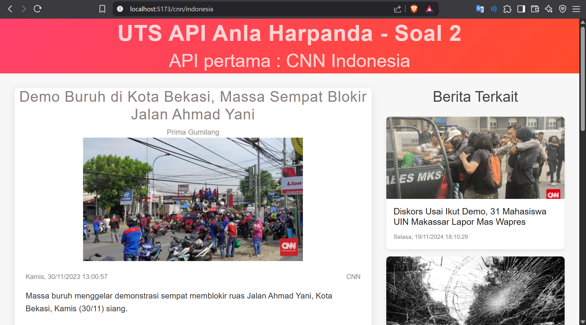
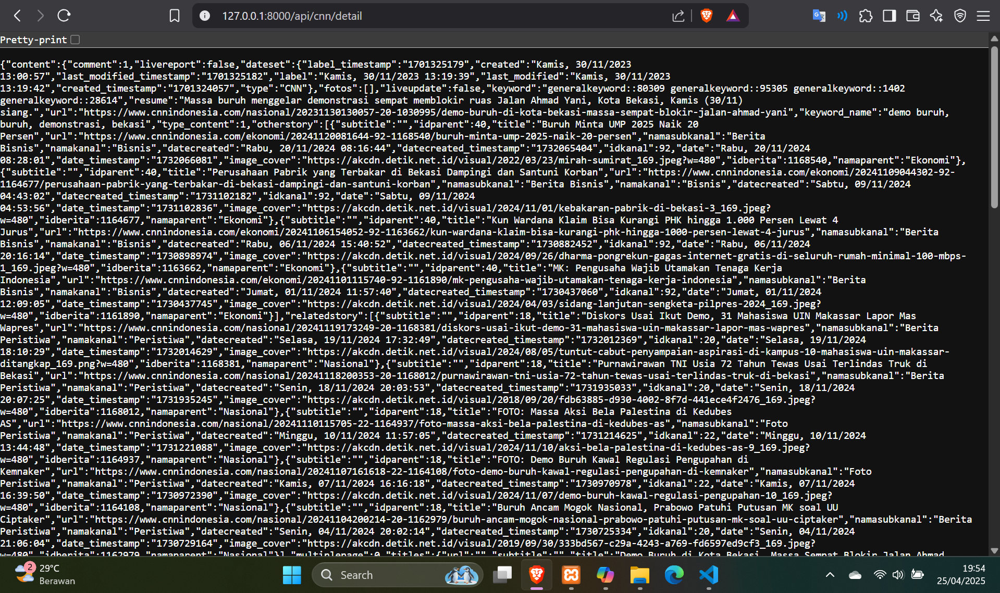
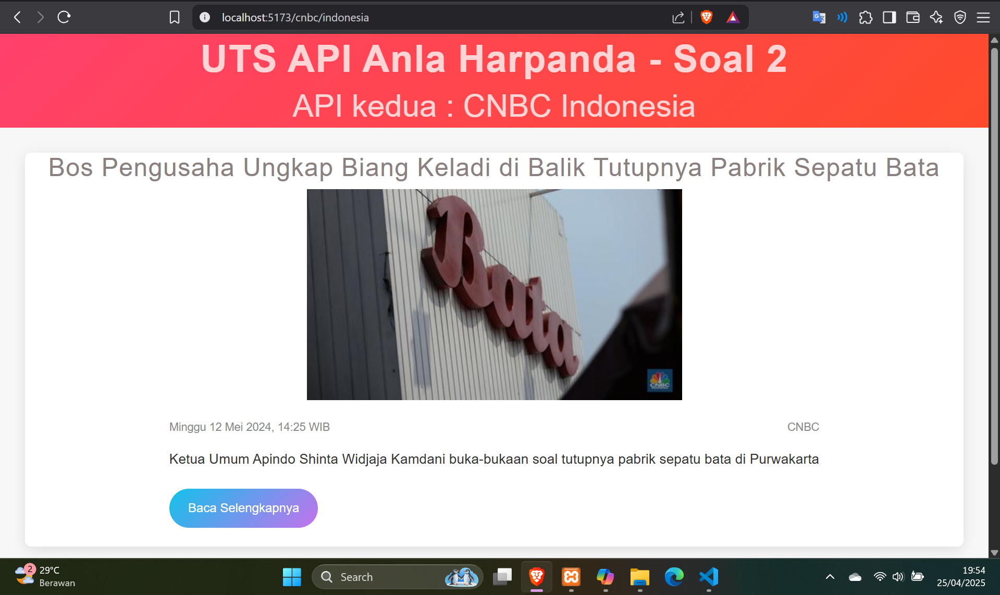

<table>
  <tr>
    <td align="center">
      <br/>CNN Frontend
    </td>
    <td align="center">
      <br/>CNN Backend
    </td>
  </tr>
  <tr>
    <td align="center">
      <br/>CNBC Frontend
    </td>
    <td align="center">
      <br/>CNBC Backend
    </td>
  </tr>
</table>

---
<div align="center">
  <b><h1>UTS KonstrksiPL Anla Soal 2</h1></b>
</div>

# News Application

Aplikasi ini menggunakan dua framework utama:

- **Backend**: Laravel
- **Frontend**: Vue.js

Aplikasi ini memanfaatkan dua API dari RapidAPI:

- **CNN API**:  
  `https://indonesia-news.p.rapidapi.com/detail/cnn`
  
- **CNBC API**:  
  `https://indonesia-news.p.rapidapi.com/detail/cnbc`

Gantilah `<URL_BERITA_CNN>` dan `<URL_BERITA_CNBC>` dengan URL berita yang sesuai, yang telah di-encode.

---

## Cara Menjalankan Setelah Clone

1. Clone repository:

   ```bash
   git clone https://github.com/username/news-app.git
   cd news-app
   ```

### 1. Menjalankan Backend (Laravel)

   - Install dependensi:

     ```bash
     composer install
     ```

   - Salin file konfigurasi `.env`:

     ```bash
     cp .env.example .env
     ```

   - Atur konfigurasi `.env` seperti database dan `RAPIDAPI_KEY`.

   - Generate aplikasi key:

     ```bash
     php artisan key:generate
     ```

   - Jalankan migrasi database:

     ```bash
     php artisan migrate
     ```

   - Jalankan server Laravel:

     ```bash
     php artisan serve
     ```

   Backend Laravel akan berjalan di `http://127.0.0.1:8000`.

### 2. Menjalankan Frontend (Vue.js)

   - Install dependensi:

     ```bash
     npm install
     ```

   - Jalankan frontend Vue.js:

     ```bash
     npm run serve
     ```

   Frontend Vue.js akan berjalan di `http://localhost:8080`.

---

## Struktur Direktori

```
- assets/                  # Folder untuk menyimpan gambar
  - CnbcBackend.png        # Gambar untuk backend CNBC
  - CnbcView.png           # Gambar untuk frontend CNBC
  - CnnBackend.png         # Gambar untuk backend CNN
  - CnnView.png            # Gambar untuk frontend CNN
- backend/                 # Folder backend Laravel
  - ...
- frontend/                # Folder frontend Vue.js
  - ...
```

---

Terima kasih telah menggunakan aplikasi ini! Jika Anda memiliki pertanyaan atau masalah, jangan ragu untuk membuka issue di repository ini.
